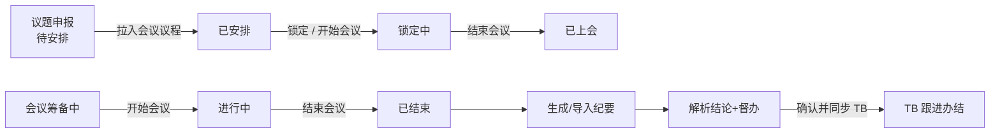
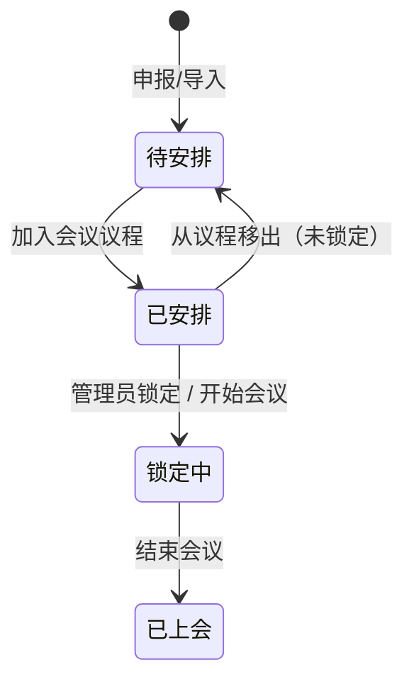
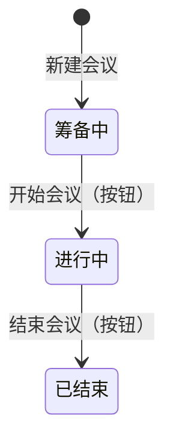
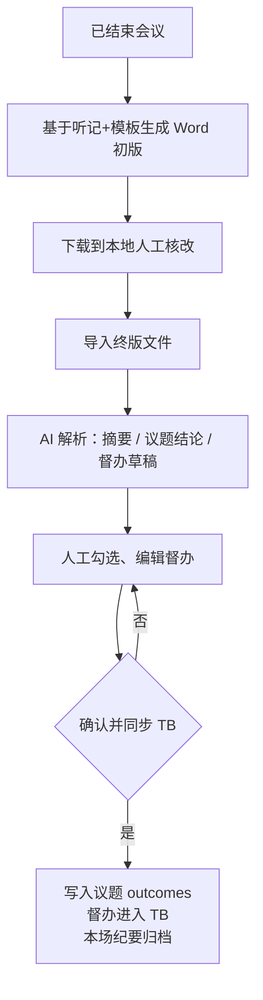

# 会议管理闭环系统 — 需求设计文档（开发版）

> 版本：基于当前前端原型（`src/App.tsx`）整理  
> 受众：后端 / 前端开发、产品联调  
> 目标：说明议题、会议、会议纪要、督办（交办）事项的串联关系、状态机与功能边界

---

## 1. 系统定位

本系统覆盖会议全流程闭环：

**议题申报 → 会议筹备与议程编排 → 会中管控 → 会后纪要 → 督办交办（同步 TB）**

系统本身负责「会议业务主数据与流程状态」；**督办事项的日常跟进、办结、驳回在 TB（任务系统）完成**。本系统可新建交办、可从纪要解析生成交办并同步 TB，但不同步后不在本系统内做关闭/驳回操作。

---

## 2. 核心对象与关系

### 2.1 对象一览

| 对象 | 说明 | 关键状态字段 |
|------|------|--------------|
| 会议类型 `MeetingType` | 字典：归属于「总经办 / 经营管理会」，维护常见主持人、出席/列席/纪检人员 | `enabled` |
| 议题 `Topic` | 上会内容载体，含材料、拟上会议、结论回写 | `status` |
| 会议 `Meeting` | 一场具体会议，挂接议程议题列表 | `status` |
| 议程项 `MeetingTopic` | 会议与议题的多对多关联（含顺序、本场时长） | — |
| 会议纪要 `Minutes` | 按会议归档：初版 Word → 终版导入 → 摘要/结论/督办 | 归档与否 |
| 督办/交办 `ActionItem` | 来自会议决议或手工新建，主闭环在 TB | `status` |

### 2.2 关系示意

```text
会议类型(1) ─────────────< 会议(N)
   │                         │
   │ category                │ meetingTopics[]
   │                         ▼
议题.topicKind ◄────────── 议程项(MeetingTopic)
   │                         │ topicId
   │                         ▼
   └──────────────────────► 议题(Topic)
                              │
                              │ outcomes[]（上会结论回写）
                              ▼
已结束会议 ──► 会议纪要 ──► 督办事项 ──同步──► TB
                 │              │
                 └─ conclusions ┘
```

### 2.3 关键外键约定（实现建议）

| 关系 | 建议字段 |
|------|----------|
| 会议 → 会议类型 | `meeting.typeId` |
| 议程 → 议题 | `meetingTopic.topicId` + `order` + `customMins?` |
| 议题结论 → 会议 | `topic.outcomes[].meetingId` |
| 督办 → 会议 | `action.meetingId` |
| 督办 → TB | `action.tbTaskId`（对接时新增） |

> 同一议题同一时刻建议只挂在一场未结束会议中；从会议移出且状态为「已安排」时回退为「待安排」。

---

## 3. 全流程总览



闭环主线：

1. 员工/管理员申报议题（待安排）  
2. 管理员建会、编排议程 → 议题变已安排  
3. 锁定或开始会议 → 议题变锁定中（不可改内容与材料）  
4. 结束会议 → 会议已结束，议题已上会  
5. 纪要初版 → 本地核改 → 导入终版 → AI 解析结论与督办  
6. 确认督办并同步 TB；后续跟进/办结在 TB  

---

## 4. 议题（Topic）

### 4.1 状态机

| 状态 | 含义 | 可编辑内容/材料 | 可删除 | 可拉入议程 |
|------|------|-----------------|--------|------------|
| **待安排** | 已申报，未进入任何会议议程 | ✅ | ✅（仅此状态） | ✅ |
| **已安排** | 已挂入某场会议议程 | ✅ | ❌ | ❌（已占用） |
| **锁定中** | 已锁定或会议已开始 | ❌ | ❌ | ❌；不可移出议程 |
| **已上会** | 所属会议已结束 | ❌（含材料） | ❌ | ❌ |



### 4.2 触发规则（必须实现）

| 事件 | 议题状态变化 |
|------|----------------|
| 新建/Excel 导入 | → `待安排` |
| 会议议程「加入议题」 | `待安排` → `已安排` |
| 会议议程「移除议题」 | 仅允许 `已安排`；→ `待安排`；`锁定中/已上会` 禁止移除 |
| 管理员「锁定议题」 | `已安排` → `锁定中` |
| 「开始会议」 | 本场议程内 `待安排/已安排` → `锁定中` |
| 「结束会议」 | 本场议程内议题 → `已上会` |
| 删除议题 | **仅 `待安排`**；若误挂在会议中应同步清理议程（产品上待安排一般不在议程中） |

### 4.3 议题类型与拟上会议

- `topicKind`：`总经办议题` | `经营管理会议题`  
- 拟上会议 `targetMeetings[]`：从会议类型字典中按 kind 过滤可选类型名称  
- 拉入议程时：议题的拟上会议必须包含本场会议类型名称  

两类表单差异（实现时注意校验）：

| 项 | 总经办议题 | 经营管理会议题 |
|----|------------|----------------|
| 紧急程度 | 有（紧急/急/一般） | 无 |
| 三重一大 | 有 | 无 |
| 时长 | 可选预设 | 预设 + 自定义分钟 |
| Excel 模板 | 分模板、分表头 | 分模板、分表头 |

### 4.4 功能清单

- 申报 / 编辑（受状态约束）  
- 查看（任意状态）  
- 删除（仅待安排）  
- 锁定（管理员，已安排）  
- Excel 批量导入（管理员；可按角色 scope 锁定议题类型）  
- 相似议题提示、关联议题  
- 人员字段：选人组件（姓名/部门/岗位搜索），非纯文本  
- 语音填报（原型能力，对接时可选）  
- 上会后回写 `outcomes[]`（结论、纪要文件名等）  

### 4.5 权限可见性

| 角色视角 | 议题可见范围 |
|----------|--------------|
| 普通员工 | 本人作为经办人或汇报人的议题；可申报 |
| 总经办管理员 | 总经办类议题全量（scope） |
| 经营管理会管理员 | 经营管理会类议题全量 |
| 统筹管理员 | 全部 |

> 「议题申报」模块对所有登录用户开放；其他业务模块按角色 modules / scope 控制。

---

## 5. 会议（Meeting）

### 5.1 状态机

| 状态 | 含义 | 可编辑会议信息 | 可编排议程 | 可删除 |
|------|------|----------------|------------|--------|
| **筹备中** | 未开会 | ✅ | ✅ | ✅（仅此） |
| **进行中** | 已开始 | ✅（建议保留） | ✅（锁定议题不可移出） | ❌ |
| **已结束** | 已闭会 | ❌（建议） | ❌ | ❌ |



### 5.2 开始 / 结束（显式按钮，非自动）

**开始会议**（入口：会议列表 / 会议详情）

1. 会议：`筹备中` → `进行中`  
2. 本场议程议题：`待安排/已安排` → `锁定中`  
3. 可跳转「会中管控」

**结束会议**（入口：会议列表 / 会议详情 / 会中管控页）

1. 会议：`进行中` → `已结束`  
2. 本场议程议题 → `已上会`  
3. 之后进入「会议纪要」处理队列  

### 5.3 会议功能清单

- 按会议类型模块进入列表；新建会议  
- 新建时按会议类型自动带入常见主持人、出席/列席/纪检人员（可改）  
- 编辑会议信息（筹备中/进行中）：时间地点、组织人、参会人员等；**不可改会议类型**  
- 议程：添加（仅待安排且拟上本类型）、排序、改本场时长、移除（受议题状态约束）  
- 会前：钉钉日程、拉群、导出议程、发送通知（渠道：群机器人/邮件/领导推送）  
- 会中管控：多场进行中并行；当前议题切换、通知下一汇报人等  
- 删除：仅筹备中；删除后释放仅挂在本场且未上会的议题回 `待安排`  

### 5.4 会议类型字典

- 归属：`总经办` | `经营管理会`  
- 维护常见人员组，供新建会议自动填充  
- 已有会议引用的类型：**不可删除，可停用**  

---

## 6. 会议纪要（Minutes）

仅处理 **已结束** 的会议。

### 6.1 流程



### 6.2 业务规则

| 步骤 | 规则 |
|------|------|
| 生成初版 | 套用会议类型对应纪要模板；输出 Word |
| 导入终版 | 建议先有初版再导入（产品可强制） |
| 议题结论 | 按本场议程议题解析；确认后写入 `topic.outcomes` |
| 督办草稿 | 可增删改、勾选；**同步 TB 前可编辑** |
| 同步 TB 后 | **不允许「重新编辑」**；跟进/办结去 TB |
| 已归档会议 | 可查阅；重新上传策略按产品定（原型允许重新上传） |

### 6.3 与议题的回写

确认后，对每个议题结论写入类似：

```ts
TopicOutcome {
  meetingId, meetingTitle, meetingDate,
  conclusion, minutesFileName, minutesFileSize?
}
```

议题详情中展示「审议结论与对应纪要」。

---

## 7. 督办 / 交办事项（Action）

### 7.1 来源

1. **纪要解析生成** → 确认并同步 TB（主路径）  
2. **本系统手工「新建事项」**（允许）→ 建议创建时同样推 TB  

### 7.2 状态（展示用；闭环在 TB）

| 状态 | 含义 | 本系统操作 |
|------|------|------------|
| 跟进中 | TB 进行中 | 仅查看 / 筛选 |
| 待确认关闭 | 责任人已在 TB 申请关闭 | **不提供**确认关闭/驳回；提示去 TB |
| 已关闭 | TB 已办结 | 仅查看 |

### 7.3 明确不做的操作

- ❌ 本系统内「确认关闭」「驳回」  
- ❌ 纪要同步 TB 后的「重新编辑」督办列表  

### 7.4 建议字段（对接 TB）

`id, meetingId, title, description, assignee, follower, dept, assignedAt, deadline, status, tbTaskId, syncedAt`

---

## 8. 四者串联时序（开发验收主路径）

```text
① 用户申报议题 A → 待安排
② 管理员新建会议 M（筹备中），将 A 加入议程 → A=已安排
③ 管理员锁定 A 或点击「开始会议」→ M=进行中，A=锁定中（不可改材料）
④ 会中管控使用 M
⑤ 点击「结束会议」→ M=已结束，A=已上会
⑥ 纪要：生成初版 → 导入终版 → 解析出 A 的结论 + 督办列表
⑦ 确认并同步 TB → A.outcomes 写入；督办在 TB 跟进
⑧ 交办页可查看同步结果；可另建手工交办；不可在本系统关闭/驳回
```

---

## 9. 状态对照速查

### 9.1 会议 vs 议题（同场联动）

| 会议动作 | 会议状态 | 本场议题状态 |
|----------|----------|--------------|
| 新建 | 筹备中 | （加入后）已安排 |
| 开始会议 | 进行中 | 锁定中 |
| 结束会议 | 已结束 | 已上会 |
| 删除会议（仅筹备中） | 删除 | 仅挂本场的已安排/锁定中 → 待安排 |

### 9.2 编辑权限速查

| 对象状态 | 内容编辑 | 材料编辑 | 删除 |
|----------|----------|----------|------|
| 议题-待安排 | ✅ | ✅ | ✅ |
| 议题-已安排 | ✅ | ✅ | ❌ |
| 议题-锁定中 | ❌ | ❌ | ❌ |
| 议题-已上会 | ❌ | ❌ | ❌ |
| 会议-筹备中 | ✅ | 议程✅ | ✅ |
| 会议-进行中 | ✅ | 议程受限 | ❌ |
| 会议-已结束 | ❌ | ❌ | ❌ |

---

## 10. 角色与数据隔离

| 角色 | scope | 典型能力 |
|------|-------|----------|
| 统筹管理员 | 无（全部） | 全数据；角色与会议类型维护 |
| 总经办管理员 | 总经办 | 仅总经办会议/议题/纪要/交办 |
| 经营管理会管理员 | 经营管理会 | 仅该类数据 |
| 普通员工 | — | 议题申报与本人议题；不进会议管理等模块 |

隔离维度：议题按 `topicKind`→分类；会议按 `typeId`→会议类型→`category`；交办按来源会议的 category。

---

## 11. 模块功能地图

| 模块 | 功能要点 |
|------|----------|
| 驾驶舱 | 办结率、归档率、排期率、交办办结率；待办跳转 |
| 会议类型 | CRUD、启停、常见人员 |
| 议题管理/申报 | 申报、导入、锁定、按状态筛选 |
| 会议管理 | 分类型列表、建会、编辑、议程、开始/结束、删除（筹备中） |
| 会中管控 | 选择进行中会议、议题进度、通知下一议题、结束会议 |
| 会议纪要 | 初版→终版→解析→同步 TB |
| 交办事项 | 一览、筛选、新建；状态只读同步；办结去 TB |
| 角色权限 | 管理员角色与成员维护（无「议题申报人」角色） |

---

## 12. 接口与实现建议（后端）

### 12.1 建议 API 分组

- `GET/POST/PATCH/DELETE /topics`（删除校验 status=待安排）  
- `POST /topics/import`  
- `POST /topics/{id}/lock`  
- `GET/POST/PATCH /meetings`（删除校验 status=筹备中）  
- `PUT /meetings/{id}/agenda`（整表提交顺序与时长）  
- `POST /meetings/{id}/start`、`POST /meetings/{id}/end`（**服务端事务内同步改议题状态**）  
- `POST /meetings/{id}/minutes/draft`、`POST .../minutes/final`、`POST .../minutes/confirm-sync`  
- `GET/POST /actions`；关闭类接口不开放给本系统 UI（或仅 TB Webhook 回写状态）  

### 12.2 事务一致性（重点）

「开始会议」「结束会议」「加入/移出议程」必须在服务端原子更新 **会议 + 议题状态**，避免前端只改一端。

推荐伪代码：

```text
startMeeting(meetingId):
  assert meeting.status == 筹备中
  meeting.status = 进行中
  for topic in agenda:
    if topic.status in (待安排, 已安排): topic.status = 锁定中
  commit

endMeeting(meetingId):
  assert meeting.status == 进行中
  meeting.status = 已结束
  for topic in agenda: topic.status = 已上会
  commit
```

### 12.3 TB 对接

- 同步成功后本地标记 `synced=true`，UI 隐藏重新编辑  
- TB 状态变更可通过 Webhook 回写 `跟进中/待确认关闭/已关闭` 供本系统展示  

---

## 13. 非功能与原型说明

- 当前仓库为 React 原型，状态存在前端 memory；正式环境需持久化与权限鉴权。  
- 人员选择应对接组织通讯录（姓名、部门、岗位）。  
- 纪要 AI 解析、听记、钉钉通知在原型中为模拟，需替换真实服务。  
- `dist/` 为构建产物，不入库。  

---

## 14. 验收用例（最小集）

1. 待安排议题可删；已安排/锁定中/已上会不可删。  
2. 仅待安排可加入议程；加入后变已安排；移出后回待安排。  
3. 锁定后不可改字段与材料；不可移出议程。  
4. 开始会议后会议=进行中、议题=锁定中。  
5. 结束会议后会议=已结束、议题=已上会；材料只读。  
6. 进行中/已结束会议无删除按钮。  
7. 纪要同步 TB 后无「重新编辑」；交办页无确认关闭/驳回。  
8. 交办页可手工新建事项。  
9. 角色 scope 隔离总经办 vs 经营管理会数据。  

---

## 15. 附录：状态枚举（与代码一致）

```ts
type TopicStatus = '待安排' | '已安排' | '锁定中' | '已上会'
type MeetingStatus = '筹备中' | '进行中' | '已结束'
type ActionStatus = '跟进中' | '待确认关闭' | '已关闭'
type TopicKind = '总经办议题' | '经营管理会议题'
type MeetingTypeCategory = '总经办' | '经营管理会'
```

---

*文档结束。若产品规则变更，请优先改「状态机 / 触发规则 / 验收用例」三节并同步前后端。*
