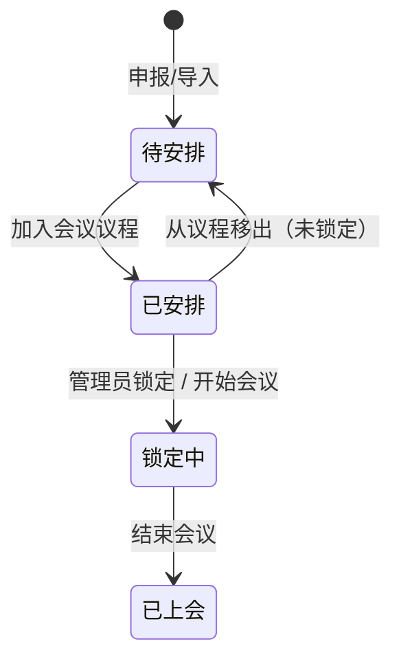
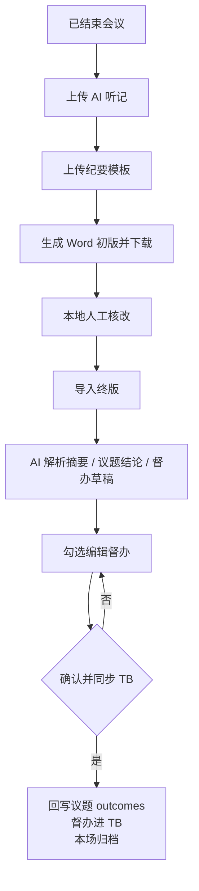

# 智会 — 产品需求说明书


| 项    | 内容                      |
| ---- | ----------------------- |
| 产品名称 | 智会                      |
| 口号   | 议而有决 · 决而有行             |
| 文档版本 | V1.0                    |
| 日期   | 2026-09-15              |
| 受众   | 产品、前端、后端、测试、钉钉 / TB 对接  |
| 目标   | 作为开发可直接拆任务、出接口、写用例的需求基线 |


## 1. 概述

### 1.1 系统定位

覆盖集团会议全流程闭环：

**议题申报 → 会议筹备与议程编排 → 会中管控 → 会后纪要 → 督办交办（同步 TB）**

本系统是会议业务主数据与流程状态中枢。**督办事项的日常跟进、申请关闭、驳回、办结在 TB（任务系统）完成**。本系统可新建交办、可从纪要解析生成交办并同步 TB，同步后不在本系统内执行关闭 / 驳回。

### 1.2 建设目标


| 目标    | 说明                                     |
| ----- | -------------------------------------- |
| 议题可追溯 | 从申报、排期、锁定、上会到结论回写全程可查                  |
| 会前可编排 | 按会议类型建会、带入常见人员、编排议程并通知                 |
| 会中可管控 | 多场并行；切换当前议题、通知下一汇报人、结束会议               |
| 会后可闭环 | 听记 + 模板生成纪要初版 → 终版解析 → 结论回写议题 → 督办进 TB |
| 权限可隔离 | 总经办 / 经营管理会数据按角色 scope 隔离；普通员工仅本人议题    |


### 1.3 范围

**在范围内**

- 议题申报 / 管理、Excel 导入、相似议题提示、语音填报（对接可选）
- 会议类型字典、会议筹备、议程、开始 / 结束会议
- **组合会期**：同日连开多场会议（Session 容器）；类型入口网格不膨胀
- 会前：钉钉日程、拉群、导出议程、多渠道通知
- 会中管控
- 会议纪要初版 / 终版 / AI 解析 / 同步 TB
- 交办一览与手工新建（状态只读同步）
- 角色与成员、数据范围、模块授权
- 驾驶舱指标与待办提示


### 1.4 术语


| 术语      | 定义                                  |
| ------- | ----------------------------------- |
| 会议类型    | 字典对象，如「广汽集团总经理办公会」，归属「总经办」或「经营管理会」  |
| 议题      | 上会内容载体，含材料、拟上会议、结论回写                |
| 会议      | 一场具体会议实例，挂接议程议题列表                   |
| 组合会期 / Session | 同日连开的多场 Meeting 容器（非会议类型）；会前可一次推送组合通知，会中可按子会切换 |
| 议程项     | 会议与议题的多对多关联（顺序、本场时长）                |
| 纪要      | 按会议归档：初版 Word → 终版导入 → 摘要 / 结论 / 督办 |
| 交办 / 督办 | 来自决议或手工新建，主闭环在 TB                   |
| TB      | 外部任务系统；本系统同步创建任务并回写状态供展示            |
| scope   | 角色数据范围：全部 / 仅总经办 / 仅经营管理会           |
| 锁定      | 议题进入「锁定中」，内容与材料不可改、不可移出议程           |


---


## 2. 用户与权限


### 2.1 身份模型

登录人同时具备：

- **用户身份**：组织通讯录人员（姓名、部门、岗位）
- **角色**：管理类角色之一，或系统内置「普通员工」


### 2.2 预置角色


| 角色       | 系统预置             | scope    | 可访问模块              | 典型成员（原型） |
| -------- | ---------------- | -------- | ------------------ | -------- |
| 统筹管理员    | 是                | 全部（null） | 全部模块含会议类型、角色管理     | 王总助      |
| 总经办管理员   | 是                | 总经办      | 驾驶舱、议题、会议、会中、纪要、交办 | 李秘书、周文员  |
| 经营管理会管理员 | 是                | 经营管理会    | 同上（不含会议类型、角色管理）    | 陈助理      |
| 普通员工     | 内置，**不在角色管理中维护** | —        | **仅议题申报**          | 任意登录人    |


规则：

- 普通员工无需建角色；凡进入系统即可申报议题，且仅看本人作为**经办人或汇报人**的议题。
- 「议题申报」模块对所有登录用户开放，不依赖角色 modules 配置。
- 仅 **scope = 全部** 的管理角色可进入「角色管理」。
- scope 非空的管理角色**不可**访问「会议类型」模块（原型：勾选「仅总经办 / 仅经营管理会」时自动去掉会议类型模块）。
- 系统预置角色不可删除，可停用；当前登录角色不可停用 / 删除。


### 2.3 数据隔离


| 对象    | 管理员可见规则                                 | 普通员工                                |
| ----- | --------------------------------------- | ----------------------------------- |
| 议题    | scope 为空看全部；否则 `topicKind` 映射分类 = scope | `submitter = 本人` 或 `presenter = 本人` |
| 会议    | 会议类型 `category` = scope（或全部）            | 不可见                                 |
| 会议类型  | 同上                                      | 不可见                                 |
| 纪要    | 按所属会议隔离                                 | 不可见                                 |
| 交办    | 按来源会议隔离                                 | 不可见                                 |
| 驾驶舱统计 | 仅统计 scope 内数据                           | 不可见                                 |


映射：

- `topicKind = 经营管理会议题` → 分类「经营管理会」
- 其他议题 → 「总经办」
- 会议分类 = `meeting.typeId` 对应会议类型的 `category`


### 2.4 模块授权矩阵


| 模块    | 普通员工  | 总经办管理员     | 经营管理会管理员   | 统筹管理员 |
| ----- | ----- | ---------- | ---------- | ----- |
| 管理驾驶舱 | ❌     | ✅（仅总经办）    | ✅（仅经营管理会）  | ✅     |
| 会议类型  | ❌     | ❌          | ❌          | ✅     |
| 议题申报  | ✅（本人） | ✅（scope 内） | ✅（scope 内） | ✅     |
| 会议管理  | ❌     | ✅（scope 内） | ✅（scope 内） | ✅     |
| 会中管控  | ❌     | ✅（scope 内） | ✅（scope 内） | ✅     |
| 会议纪要  | ❌     | ✅（scope 内） | ✅（scope 内） | ✅     |
| 交办事项  | ❌     | ✅（scope 内） | ✅（scope 内） | ✅     |
| 角色管理  | ❌     | ❌          | ❌          | ✅     |


能进入模块 ≠ 可见全量数据。总经办管理员仅总经办分类；经营管理会管理员仅经营管理会分类；隔离规则见 §2.3（会议按类型 `category`，纪要/会中按其会议，交办按来源会议）。统筹管理员不受 scope 限制。

Excel 导入：管理员可用；总经办管理员只能导入「总经办议题」；经营管理会管理员只能导入「经营管理会议题」；统筹管理员可选分类。

## 4. 领域模型

### 4.2 枚举（与原型一致）

```ts
type TopicStatus = '待安排' | '已安排' | '锁定中' | '已上会'
type MeetingStatus = '筹备中' | '进行中' | '已结束'
type ActionStatus = '跟进中' | '待确认关闭' | '已关闭'
type TopicKind = '总经办议题' | '经营管理会议题'
type MeetingTypeCategory = '总经办' | '经营管理会'
type Urgency = '紧急' | '急' | '一般'
type Priority = '高' | '中' | '低'   // 由紧急程度派生，列表展示以紧急程度为准
```

紧急程度 → 优先级：紧急→高，急→中，一般→低。经营管理会议题无紧急程度字段，priority 固定为「中」，urgency 存「一般」，列表紧急程度列显示「—」。

### 4.3 会议类型 MeetingType


| 字段              | 类型          | 必填   | 说明                   |
| --------------- | ----------- | ---- | -------------------- |
| id              | string      | 系统生成 | 如 `gac-gm-office`    |
| name            | string      | 是    | 全系统唯一                |
| desc            | string      | 否    | 用途说明                 |
| category        | 总经办 / 经营管理会 | 是    | 决定议题拟上会议过滤与权限隔离      |
| color / bg      | string      | 系统   | 卡片配色                 |
| enabled         | boolean     | 是    | 停用后不可用于新建会议 / 拟上会议选项 |
| usualLocation     | string      | 否    | 新建会议自动带入地点           |
| usualChair        | 人员          | 否    | 新建会议自动带入主持人          |
| usualOrganizer    | 人员          | 否    | 新建会议自动带入组织人          |
| usualOrganizeDept | string      | 否    | 新建会议自动带入组织部门；选组织人后若部门在字典内则自动带出 |
| usualAttendees    | 人员[]        | 否    | 常见出席                 |
| usualObservers    | 人员[]        | 否    | 常见列席                 |
| usualDiscipline   | 人员[]        | 否    | 常见纪检                 |


预置类型（可在「会议类型」中维护）：


| 分类    | 名称          | 说明            |
| ----- | ----------- | ------------- |
| 总经办   | 广汽集团总经理办公会  | 总经理主持的综合性决策会议 |
| 总经办   | 广汽集团党委会     | 党委决策会议        |
| 总经办   | 广汽集团董事会     | 董事会会议         |
| 总经办   | 广汽工业集团党委会   | 工业集团党委决策会议    |
| 总经办   | 广汽集团工业集团董事会 | 工业集团董事会会议     |
| 总经办   | 广州工业集团专题会   | 专项研究会议        |
| 经营管理会 | 月度经营分析会     | 月度经营数据复盘与策略研判 |
| 经营管理会 | 经营调度会       | 跨板块经营调度与协同推进  |


已有会议引用的类型：**不可删除，可停用**。

### 4.4 议题 Topic


| 字段                                      | 类型                | 必填    | 说明                        |
| --------------------------------------- | ----------------- | ----- | ------------------------- |
| id                                      | string            | 系统    | 如 `T001`                  |
| title                                   | string            | 是     | 议题名称                      |
| topicKind                               | TopicKind         | 是     | 议题类型                      |
| status                                  | TopicStatus       | 系统    | 见状态机                      |
| isTradeSecret                           | boolean           | 是     | 是否商密                      |
| isMajorDecision                         | boolean           | 总经办必填 | 是否三重一大；经营管理会强制 false      |
| urgency                                 | Urgency           | 总经办必填 | 经营管理会不采集                  |
| targetMeetings                          | string[]          | 是     | 拟上会议，存**会议类型名称**，可多选      |
| preBrief.leader / gm / chairman         | boolean           | 否     | 前置汇报：分管领导 / 总经理 / 董事长     |
| dept                                    | string            | 是     | 经办部门                      |
| submitter                               | 人员                | 是     | 经办人                       |
| presenter                               | 人员                | 是     | 汇报人                       |
| estimatedMins                           | number            | 是     | 申报时长（分钟）                  |
| attendDepts                             | string            | 否     | 需列席部门（文本）                 |
| attendEnterprises                       | string            | 否     | 需列席企业                     |
| notes                                   | string            | 否     | 备注                        |
| materials                               | 文件[]              | 申报必填  | 至少 1 份；导入议题可先占位「（导入待补材料）」 |
| relatedTopicIds                         | string[]          | 否     | 关联历史议题（可多选）              |
| submittedAt                             | date              | 系统    | 提报日期                      |
| aiSummary                               | string            | 系统    | 申报后异步生成系统概要               |
| background / objective / decisionPoints | string / string[] | 否     | 历史/导入可存；申报表单以备注为主         |
| outcomes                                | TopicOutcome[]    | 系统    | 上会结论回写                    |


**TopicOutcome**


| 字段                                     | 说明     |
| -------------------------------------- | ------ |
| meetingId / meetingTitle / meetingDate | 来源会议   |
| conclusion                             | 审议结论   |
| minutesFileName / minutesFileSize      | 对应纪要文件 |


### 4.5 会议 Meeting


| 字段              | 类型             | 必填  | 说明                                           |
| --------------- | -------------- | --- | -------------------------------------------- |
| id              | string         | 系统  | 建议 `M{yyyyMM}-{随机}`                          |
| title           | string         | 是   | 会议名称                                         |
| typeId          | string         | 是   | 会议类型；**编辑不可改**                               |
| date            | date           | 是   | 会议日期                                         |
| time / endTime  | time           | 否   | 开始 / 结束时间                                    |
| location        | string         | 否   | 地点                                           |
| chair           | 人员             | 否   | 主持人                                          |
| organizer       | 人员             | 否   | 会议组织人；选人后若部门在组织部门字典内则自动带出                    |
| organizeDept    | 枚举             | 否   | 集团办公室 / 党委办公室 / 董事会办公室 / 战略发展部 / 人力资源部 / 综合室 |
| attendees       | 人员[]           | 否   | 出席                                           |
| observers       | 人员[]           | 否   | 列席                                           |
| disciplineStaff | 人员[]           | 否   | 纪检                                           |
| meetingTopics   | MeetingTopic[] | —   | 议程                                           |
| status          | MeetingStatus  | 系统  | 新建=筹备中                                       |
| notes           | string         | 否   | 备注 / 归档说明                                    |
| sessionId       | string?        | 否   | 所属组合会期；单场会议为空                              |


**MeetingTopic**：`topicId` + `order`（从 1）+ `customMins?`（本场覆盖议题申报时长）。

本场展示时长 = `customMins ?? topic.estimatedMins`。可编辑范围 5–120 分钟。合计超过 180 分钟时提示「超过 3 小时，建议精简议程」。议程时间轴按会议开始时间累加，展示每项开始/结束时刻。

### 4.5.1 组合会期 MeetingSession

同日连开的多场 Meeting 容器。**不是会议类型**：类型字典与入口网格保持固定，不因组合增多而膨胀。


| 字段           | 类型       | 说明                          |
| ------------ | -------- | --------------------------- |
| id           | string   | 建议 `S{yyyyMMdd}-{随机}`       |
| name         | string   | 如「9·12 总办会 + 党委会连开」         |
| date / time / endTime | — | 会期窗口（可覆盖各子会时段）      |
| location     | string   | 共用地点（子会可另有字段，原型常一致）         |
| organizer / organizeDept | — | 会期组织信息                  |
| meetingIds   | string[] | 子会 Meeting.id，顺序即连开顺序        |
| notes        | string?  | 如「会前组合通知一次推送」               |


派生状态：全部已结束 → 已结束；任一进行中 → 进行中；全部筹备中 → 筹备中；否则 → 混合。

### 4.6 纪要 MinutesArchive

按会议 1:1（或最新一版）。


| 字段                            | 说明                                            |
| ----------------------------- | --------------------------------------------- |
| meetingId                     | 所属会议                                          |
| draftFile                     | 初版 Word                                       |
| transcriptFile / templateFile | 生成初版所用听记、模板                                   |
| finalFile                     | 终版文件名、大小                                      |
| archivedAt                    | 归档时间                                          |
| summary                       | AI 摘要                                         |
| conclusions                   | TopicConclusion[]（topicId, title, conclusion） |
| tasks                         | 督办草稿（见下）                                      |
| synced                        | 是否已确认同步 TB                                    |


**SupervisionTask（纪要侧草稿）**


| 字段       | 必填  | 说明                   |
| -------- | --- | -------------------- |
| id       | 系统  |                      |
| text     | 是   | 督办标题                 |
| detail   | 否   | 详细内容                 |
| assignee | 是   | 责任人，展示可带部门 `姓名 / 部门` |
| follower | 否   | 跟进人                  |
| deadline | 否   | 截止日期                 |
| checked  | —   | 是否纳入本次同步 TB；默认真      |


### 4.7 交办 ActionItem


| 字段                         | 说明                                            |
| -------------------------- | --------------------------------------------- |
| id                         | 系统                                            |
| meetingId                  | 来源会议                                          |
| title / description        | 标题 / 说明                                       |
| assignee / dept / follower | 责任人 / 部门 / 跟进人                                |
| assignedAt / deadline      | 交办日 / 截止日                                     |
| status                     | 跟进中 / 待确认关闭 / 已关闭                             |
| monthlyReports[]           | `{ month, content }` 阶段性进展，**【正式环境】** 由 TB 回写 |
| tbTaskId / syncedAt        | TB 任务 ID、同步时间                                 |


### 4.8 角色 RoleDef


| 字段                               | 说明                    |
| -------------------------------- | --------------------- |
| id / name / desc / dept / avatar | 名称全系统唯一；头像一字          |
| scope                            | null=全部；总经办；经营管理会     |
| modules                          | 可访问模块；**强制包含 topics** |
| members                          | 人员列表                  |
| enabled                          | 启停                    |
| isManager                        | 管理类=true              |
| isSystem                         | 预置角色不可删               |


---


## 5. 状态机与联动（必须服务端原子实现）


### 5.1 议题状态


| 状态  | 含义          | 改内容/材料 | 删除          | 入议程 | 移出议程    |
| --- | ----------- | ------ | ----------- | --- | ------- |
| 待安排 | 已申报未入会      | ✅      | ✅（仅此；员工仅本人） | ✅   | —       |
| 已安排 | 已挂入某场议程     | ✅      | ❌           | ❌   | ✅ → 待安排 |
| 锁定中 | 管理员锁定或会议已开始 | ❌      | ❌           | ❌   | ❌       |
| 已上会 | 所属会议已结束     | ❌      | ❌           | ❌   | ❌       |





### 5.2 会议状态


| 状态  | 改会议信息 | 编排议程            | 删除    |
| --- | ----- | --------------- | ----- |
| 筹备中 | ✅     | ✅               | ✅（仅此） |
| 进行中 | ✅     | ✅（锁定/已上会议题不可移出） | ❌     |
| 已结束 | ❌     | ❌               | ❌     |


开始 / 结束为**显式按钮**，不按日历时间自动切换。

### 5.3 事件触发表


| 事件          | 会议              | 议题                      |
| ----------- | --------------- | ----------------------- |
| 新建/导入议题     | —               | → 待安排                   |
| 议程加入议题      | —               | 待安排 → 已安排               |
| 议程移除        | —               | 仅已安排 → 待安排；锁定中/已上会禁止并提示 |
| 管理员锁定       | —               | 已安排 → 锁定中               |
| 开始会议        | 筹备中 → 进行中       | 本场待安排/已安排 → 锁定中         |
| 结束会议（需二次确认） | 进行中 → 已结束       | 本场全部 → 已上会              |
| 删除议题        | 同步从所有会议议程剔除并重排序 | 仅待安排                    |
| 删除会议        | 仅筹备中可删          | 仅挂本场且未上会的已安排/锁定中 → 待安排  |


确认文案：

- 结束会议：`确认结束会议「{标题}」？结束后相关议题将标记为已上会。`
- 删除会议：`确认删除会议「{标题}」？`
- 删除议题：`确认删除议题「{标题}」？`

**【正式环境必做】**「开始会议」「结束会议」「加入/移出议程」「删除会议」必须在服务端事务内同时更新会议与议题，禁止只改一端。

---


## 6. 公共能力


### 6.1 选人组件

所有人员字段禁止纯文本输入，统一通讯录选择。

- 搜索：姓名 / 部门 / 岗位
- 单选：经办人、汇报人、主持人、组织人、责任人、跟进人、常见主持人
- 多选：出席、列席、纪检、角色成员、常见出席/列席/纪检
- 展示：`姓名 · 部门 · 岗位`；芯片可删除、可清空
- 经办人带出经办部门（部门在部门字典内时）
- 组织人带出组织部门（部门在组织部门字典内时）
- 责任人带出责任部门

**【正式环境必做】** 对接组织通讯录，支持分页搜索。

### 6.2 部门字典（议题经办部门）

战略发展部、信息技术部、人力资源部、投资发展部、合规法务部、财务管理部、市场营销部、供应链管理部、安全环保部、集团管控部。

正式环境建议改为组织主数据，允许扩展。

### 6.3 附件


| 场景       | 格式                                         | 规则                         |
| -------- | ------------------------------------------ | -------------------------- |
| 议题汇报材料   | pdf / ppt / pptx / doc / docx / xls / xlsx | 申报至少 1 份；可多份；可移除（可编辑时）     |
| 听记       | pdf / doc / docx / txt / md                | 生成初版必传                     |
| 纪要模板     | doc / docx / pdf                           | 生成初版必传                     |
| 终版纪要     | pdf / doc / docx / txt                     | 导入后触发解析                    |
| Excel 导入 | .xls / csv / txt                           | **暂不支持 .xlsx**，提示另存模板或 CSV |


锁定中 / 已上会：材料只读，提供预览 / 下载。

### 6.4 相似议题（申报时）

- 用户输入完议题名称（失焦）后，检索历史议题标题相似度 ≥ 85% 的候选项，按相似度从高到低排列
- 标题长度 ≥ 4 才检索；算法：完全相等=1；包含关系按长度比；否则 bigram Dice 系数
- 选项列表第一项固定为「无关联议题」（默认选中）；其后为相似议题，支持多选关联
- 选择任一相似议题时取消「无关联议题」；清空关联时回到「无关联议题」
- **不阻断提交**，仅提示防重复

---


## 7. 功能需求（分模块）


### 7.1 管理驾驶舱

**入口**：管理员。数据按 scope 过滤。

**KPI（可点击跳转对应模块）**


| 指标    | 公式              | 辅助信息                 |
| ----- | --------------- | -------------------- |
| 会议办结率 | 已结束场次 / 全部场次    | 本年场次、本月场次、已结束、未结束    |
| 纪要归档率 | 已归档 / 已结束       | 待归档数；已清零时标签变化        |
| 议题排期率 | (全部 − 待安排) / 全部 | 待安排数、申报总数            |
| 交办办结率 | 已关闭 / 全部交办      | 在办=跟进中+待确认关闭；逾期数；临期数 |


统计时点：以「今天」为 asOf。逾期：未关闭且 deadline < 今天。临期：跟进中且 deadline ∈ [今天, 今天+10 天]。原型演示日为 2026-08-28，正式环境用服务器日期。

**议题流转**：待安排 → 已安排 → 锁定中 → 已上会 漏斗计数。

**交办构成**：跟进中 / 待确认关闭 / 已关闭 条形占比。

**会议汇总表**：按会议类型：场次、筹备中、已结束、纪要已归档；底部合计须与当前 scope 一致。

**报表提示（可跳转）**


| 类型    | 条件         | 跳转   |
| ----- | ---------- | ---- |
| 纪要未归档 | 已结束且无归档纪要  | 会议纪要 |
| 待确认关闭 | 交办状态=待确认关闭 | 交办事项 |
| 即将到期  | 跟进中且临期     | 交办事项 |
| 已逾期   | 未关闭且过截止日   | 交办事项 |


无异常时展示「本期无异常项」。副标题标明统计周期与「仅显示{scope}数据」或「集团总部」。

---


### 7.2 会议类型

仅统筹管理员。

**列表**：按「总经办 / 经营管理会」分组。展示名称、说明、常见出席摘要、启用状态。

**新增 / 编辑**


| 字段                   | 规则          |
| -------------------- | ----------- |
| 类型名称                 | 必填、唯一       |
| 所属分类                 | 总经办 / 经营管理会 |
| 说明                   | 可选          |
| 常见主持人 / 出席 / 列席 / 纪检 | 选人          |


**操作**：编辑、启用/停用、删除（被会议引用则禁止，提示「该类型已有会议记录，不可删除，可停用。」）。

---


### 7.3 议题申报 / 议题管理


#### 7.3.1 列表

- 管理员标题「议题管理」；员工「议题申报」
- 筛选：全部 / 待安排 / 已安排 / 锁定中 / 已上会，带数量
- 列：编号、议题类型、议题名称（副行展示结论或拟上会议/备注）、经办部门、经办人、汇报人、紧急程度、时长、状态、操作
- 操作：编辑或查看；管理员对已安排可「锁定」；待安排且有权可「删除」
- 主按钮：`+ 申报议题`；管理员另有「Excel 导入」


#### 7.3.2 申报 / 编辑表单（弹窗，宽屏）

**可编辑**：新建，或状态 ∈ {待安排, 已安排}。  
**只读提示**：锁定中「议题已锁定，内容与汇报材料不可修改」；已上会「议题已上会，内容与汇报材料不可修改」。

**语音填报**【原型模拟】：可编辑时提供「语音填报」→ 录音中可结束 → 识别后自动填入示例字段。正式环境对接语音识别；失败需提示，不得覆盖用户未确认的已填内容（建议填入前可预览）。本期允许作为增强项，不阻塞主流程上线。

**字段与校验**


| 字段     | 总经办议题              | 经营管理会议题            | 校验                         |
| ------ | ------------------ | ------------------ | -------------------------- |
| 议题类型   | 下拉切换               | 同左                 | 必填；切换后拟上会议只保留新分类允许项        |
| 议题名称   | 有                  | 有                  | 必填                         |
| 是否商密   | 是/否                | 是/否                | 必填                         |
| 是否三重一大 | 是/否                | **无此字段**           | 总经办必填                      |
| 紧急程度   | 一般/急/紧急            | **无**              | 总经办必填                      |
| 拟上会议   | 多选芯片，选项=启用中的总经办类型名 | 选项=启用中的经营管理会类型名    | 至少 1 个                     |
| 前置汇报   | 分管领导/总经理/董事长 是否    | 同左                 | 可选                         |
| 经办部门   | 下拉                 | 同左                 | 必填                         |
| 经办人    | 选人                 | 同左                 | 必填；**员工不可改，固定当前登录人**；管理员可选 |
| 汇报人    | 选人                 | 同左                 | 必填                         |
| 汇报时长   | 3 / 5（一般） / 8 分钟   | 同上 +「其他时长」自定义正整数分钟 | 必填；自定义须 > 0                |
| 需列席部门  | 文本；总经办展示固定列席说明（见下） | 文本                 | 可选                         |
| 需列席企业  | 文本                 | 文本                 | 可选                         |
| 汇报材料   | 上传                 | 上传                 | **提交必填至少 1 份**             |
| 备注     | 文本                 | 文本                 | 可选                         |


总经办「需列席部门」说明（只展示，不自动写入）：

- 党委会 / 办公会固定列席无需填写，只写非固定列席部门，无则留空。
- 党委会常列席：党委办公室、党委工作部、综合室、战略本部、审计专员办；前置研究议题另增：审计部、法律与合规部、董办。
- 办公会常列席：办公室、党委工作部/团委、人力资源部/组织部、综合室、品牌公关部、董办、财务本部、审计部/业务督察部、法律与合规部、战略本部、变革与流程管理办公室。

**提交禁用条件**：缺标题 / 部门 / 经办人 / 汇报人 / 拟上会议 / 材料，或经营管理会自定义时长非法。

**保存后**：

- 新建 → 待安排；Toast「议题申报成功。」；**【正式环境】** 异步生成 `aiSummary`（原型约 1.6s 后写入模板句）。
- 编辑 → Toast「议题已保存更新。」
- 详情只读区：系统概要、审议结论、对应会议纪要（可查阅文件）、编号与提报日期。
- 已安排 + 管理员：页脚「锁定议题」。
- 待安排且有权：页脚「删除议题」。

拉入某场会议的校验：议题 `targetMeetings` **必须包含**该场会议类型名称，且状态为待安排、未被本场选中。

#### 7.3.3 Excel 批量导入（管理员）

1. 选择导入分类（受角色锁定）。
2. 下载对应 `.xls` 模板（含表头 + 一行示例，导入前应删除示例）。
3. 上传 `.xls` / `.csv` / `.txt`。`.xlsx` 明确报错。
4. 按行校验，只导入通过行。

**总经办表头**：议题名称、经办部门、经办人、汇报人、拟上会议、汇报时长、是否商密、是否三重一大、紧急程度、列席部门、列席企业、备注。

**经营管理会表头**：议题名称、经办部门、经办人、汇报人、拟上会议、汇报时长、是否商密、列席部门、列席企业、备注。

校验：

- 表头缺列 → 整文件失败，提示缺少字段
- 行级：缺名称/部门/经办人/汇报人/拟上会议；拟上会议须属于该分类启用类型（支持 `、,;；` 分隔）；时长正整数；总经办紧急程度若填则必须是 紧急/急/一般；与系统已有标题完全重复；文件内标题重复
- 是否类：`是 / Y / y / true / TRUE` 为真
- 导入成功状态=待安排；材料占位「（导入待补材料）」——正式环境应允许用户随后补传，补传前可列表标记「待补材料」

---


### 7.4 会议管理


#### 7.4.1 类型入口

首页用 **Tab** 分开，避免组合与类型入口叠在同一视口：

1. **单次会议**：会议类型卡片网格（启用且在 scope 内）。展示场次数、最近一场状态/标题/时间/出席；若该场属组合则角标「组合」。右上角「+ 新建会议」。
2. **组合会期**：MeetingSession 列表（非类型字典）。卡片展示会期名、派生状态、子会类型芯片、共同参会头像。右上角「+ 新建组合会议」。

「新建组合会议」：至少勾选 2 个启用类型；填写与单场一致的共同字段（日期/时段/地点、主持、组织人/部门、参会、列席、纪检）；人员按所选类型常见名单去重合并带入，可改；创建后写入每一场子会（`sessionId` 相同）。

#### 7.4.1a 组合详情

- 布局：左子会 Tab + 本页议程编排；右「组合操作」与共同参会人
- 顶栏右上：编辑组合、删除组合（仅全部子会筹备中可删）——与单场「编辑/删除」同位置
- 右侧组合操作：创建钉钉日程、一键拉群、导出议程、发送组合通知；其下按状态展示开始组合 / 进入会中 / 结束组合（与单场「会议操作」一致）
- 编辑：改会期名/时段/地点/共同主持与人员，同步写入各子会；子会类型不可在此增减
- 「单场详情」可进入该场完整页（会前单场操作等）
- 子会仍出现在对应类型列表，带「组合 · {会期名}」可点回组合

#### 7.4.2 某类型会议列表

排序同前。卡片：状态、编号、标题、时间地点主持、出席头像、议题数、议程标题芯片；若有 `sessionId` 显示组合角标并可打开会期。

操作：


| 状态  | 操作               |
| --- | ---------------- |
| 筹备中 | 查看/编辑、开始会议、删除    |
| 进行中 | 查看/编辑、进入会中、结束会议  |
| 已结束 | 查看/编辑（信息只读）、查看纪要 |

删除筹备中子会时，从所属 Session.meetingIds 移除；若会期无子会则删除会期。


#### 7.4.3 新建 / 编辑会议

必填：会议名称、会议日期。创建按钮在无标题或无日期时禁用。

- 新建：可选会议类型（scope 内启用项）；切换类型时标题默认改为类型名，并重新带入常见主持人/出席/列席/纪检（可改）。
- 编辑：类型只读，提示「编辑时不可更换会议类型」。已结束会议详情页不提供「编辑会议信息」。

其他字段：开始/结束时间、地点、主持人、组织人、组织部门、参会人员（可清空）、列席、纪检。

新建成功：status=筹备中，议程空。

#### 7.4.4 会议详情

左：信息条（编号、标题、时间地点、主持、组织、状态）+ 议题安排。  
右：会议操作、参会人员、列席/纪检/组织（人员默认折叠，展开查看）。议程时长已在左侧展示，不再重复「时间分配」。

**议程**

- 已结束不可添加/排序/改时长/移除
- 添加：打开议题选择器，仅待安排且拟上含本类型
- 加入后议题 → 已安排；关闭选择器（单次加一项）
- 拖拽调整顺序；改本场分钟；点击行打开议题详情；移除（锁定中/已上会禁用）
- 移除：锁定中/已上会禁用，Toast 说明原因

**会前操作**【原型模拟通道，正式环境接钉钉】


| 操作     | 行为                   |
| ------ | -------------------- |
| 创建钉钉日程 | 向参会人发日历邀请            |
| 一键拉群   | 建群并拉入全部参会人           |
| 导出议程安排 | 生成会议整体安排图（一张图：时间轴 + 议题一览），单场与组合会期共用同一能力 |
| 发送会议通知 | 见下                   |


**通知弹窗**

- 渠道多选：群机器人发到会议群（默认勾选）、邮件通知全部参会人、钉钉工作通知推送给领导
- 选「领导推送」时必须再选至少一位领导；领导候选 = 出席中姓名含「总 / 副 / 书记 / 董」者（正式环境建议改为职级/标签，而非姓名关键字）
- 无渠道或领导未选时禁用发送
- 预览：标题、时间、地点、主持、组织
- 发送成功 Toast 列出实际渠道

**开始会议**：改状态、锁定本场议题、跳转会中、Toast「会议已开始」。  
**结束会议**：确认后改状态、议题已上会。  
**删除**：仅筹备中。

---


### 7.5 会中管控

1. **会场选择**：仅「进行中」且在 scope 内的会议。**同属一个 Session 的进行中子会归为一组**展示；未归组的单独成卡。多场并行，分别进入。无会场时空态引导去会议管理开始会议。
2. **会场页**
  - 顶栏：返回、进行中徽标、会议标题（若属组合则显示会期名 + 同组进行中子会切换条）、日期/时间/地点/主持、结束会议
  - 进度条：按已完成议题申报时长 / 总时长（原型用 estimatedMins，正式环境建议用本场 customMins）
  - 左：议题列表（未开始 / 当前 / 已过）；点击切换当前议题；有下一议题时「通知下一议题汇报人 {姓名}」
  - 左下：当前议题附件预览
  - 右：AI 总结（材料生成，可复制）；决议脉络（该议题历史决策时间线：决策点、原话、日期、会议、说明）
3. 结束会议与会议详情规则相同，结束后回到会场列表（仅结束当前子会，不影响同组其他子会）。

**【正式环境】**

- 通知下一汇报人：钉钉工作通知 / 会议群
- AI 总结：基于材料 + 听记
- 决议脉络：检索该议题及关联议题的历史 outcomes / 纪要

---


### 7.6 会议纪要

仅已结束会议。左列历史会议（未归档优先，再按日期倒序），右列当前场处理区。

状态标签：纪要已归档 / 待上传纪要。

#### 流程




规则：

1. **生成初版**：听记与模板均必传，否则禁用「生成初版」。套用该会议类型模板 + 听记，输出 `{会议标题}会议纪要（初版）.docx`。可重新生成。初版结构建议含：标题、生成说明、会议概况（时间地点主持组织出席列席纪检）、按议程的议题审议、会议决议、其他事项。
2. **导入终版**：建议强制先有初版（原型：未生成初版时不展示终版上传区）。支持 PDF/Word/TXT。上传即进入解析。
3. **解析结果**：AI 摘要；按本场议程生成议题结论（可人工核改——正式环境应允许编辑结论文本）；督办列表默认识别勾选。
4. **督办草稿**：同步前可新增 / 编辑 / 删除 / 勾选。新增必填标题、责任人。
5. **确认并同步 TB**：至少勾选 1 条。成功后：勾选项创建 TB 任务；结论写入对应 `topic.outcomes`（按 meetingId 覆盖）；隐藏重新编辑；展示「已同步 N 条督办事项至 TB」。
6. **已归档**：可查阅摘要、结论、督办；允许「重新上传」终版（产品已定：原型允许）。重新上传需再次解析；**已同步 TB 的任务不在本系统删除**，增量策略由对接方案定义（建议：新解析结果与已有 tbTaskId 人工对照，避免重复建任务）。
7. 取消未归档终版：清除解析结果，并去掉本场回写的 outcomes。

---


### 7.7 交办事项

管理员。副文案明确：跟进与办结去 TB。

**统计卡**：跟进中、待确认关闭、已关闭、逾期风险（跟进中且 deadline < 今天）。

**筛选**：关键词（标题/责任人/部门/跟进人）、状态、来源会议。

**列表卡片**：标题、责任人（部门）、跟进人、交办日、截止日（逾期标红）、状态。待确认关闭展示黄条：「负责人已提交关闭申请，请前往 TB 确认办结或驳回」。**无确认关闭 / 驳回按钮。**

**详情**：来源会议、交办时间、责任人、跟进人、截止日期、事项说明、阶段性进展（TB 回写）、已关闭提示。页脚：「跟进、办结请在 TB 中操作」。

**新建事项**（允许，创建后建议立即推 TB）


| 字段          | 规则                             |
| ----------- | ------------------------------ |
| 来源会议        | 必选，范围=当前用户可见已结束会议（正式环境不要用写死字典） |
| 标题          | 必填                             |
| 说明          | 可选                             |
| 责任人         | 选人，带出部门                        |
| 责任部门        | 可改                             |
| 跟进人         | 选人                             |
| 交办时间 / 截止日期 | 日期                             |


原型「创建交办事项」未真正写入列表，**【正式环境必做】** 落库 + 同步 TB + 刷新列表。

---


### 7.8 角色管理

仅统筹管理员。

列表：名称、管理类/系统预置/当前登录徽标、说明、部门、数据范围、模块数、成员、启停、操作（切换体验仅原型有，正式环境删除）。

**新增 / 编辑**


| 字段              | 规则                               |
| --------------- | -------------------------------- |
| 角色名称            | 必填、唯一                            |
| 所属部门 / 头像字 / 说明 | 头像一字                             |
| 数据范围            | 全部会议 / 仅总经办 / 仅经营管理会             |
| 可访问模块           | 至少 1 个；议题申报锁定必选；scope 非空时会议类型不可选 |
| 角色成员            | 多选人                              |


选「全部会议」时默认勾选全部模块（含会议类型）。选分类 scope 时从 modules 去掉会议类型。

保存时 `isManager=true`，并保证 modules 含 `topics`。

---


## 8. 外部系统对接


### 8.1 组织通讯录 / 登录

钉钉 / 统一身份：登录、人员搜索、部门、岗位。

### 8.2 钉钉


| 能力   | 触发                | 说明                      |
| ---- | ----------------- | ----------------------- |
| 日程   | 会前「创建钉钉日程」        | 参会人日历邀请，含时间地点标题         |
| 拉群   | 「一键拉群」            | 建群并拉出席+列席+纪检+组织人（产品可配置） |
| 群机器人 | 会议通知渠道            | 发到会议群                   |
| 邮件   | 会议通知渠道            | 全部参会人                   |
| 工作通知 | 会议通知-领导；会中通知下一汇报人 |                         |
| 听记   | 纪要生成输入            | 可上传文件；有会议关联听记时可拉取       |


### 8.3 TB 任务

- 纪要确认、手工新建交办 → 创建 TB 任务，回写 `tbTaskId`
- Webhook / 轮询回写状态：跟进中 / 待确认关闭 / 已关闭
- 阶段性进展回写 `monthlyReports`
- 本系统 UI **不提供**关闭、驳回接口给操作员


### 8.4 AI 服务


| 场景       | 输入                          | 输出            |
| -------- | --------------------------- | ------------- |
| 议题系统概要   | 标题、部门、人员、拟上会议、时长、商密/三重一大、备注 | aiSummary     |
| 纪要初版     | 听记全文 + 模板 + 会议/议程元数据        | Word          |
| 终版解析     | 终版文本 + 本场议题列表               | 摘要、每议题结论、督办草稿 |
| 会中 AI 总结 | 当前议题材料 + 摘要                 | 短文            |
| 语音填报     | 语音流                         | 表单字段（可选期）     |


解析结论须按 `topicId` 对齐本场议程；对不齐的内容放入「其他事项」或待人工认领。